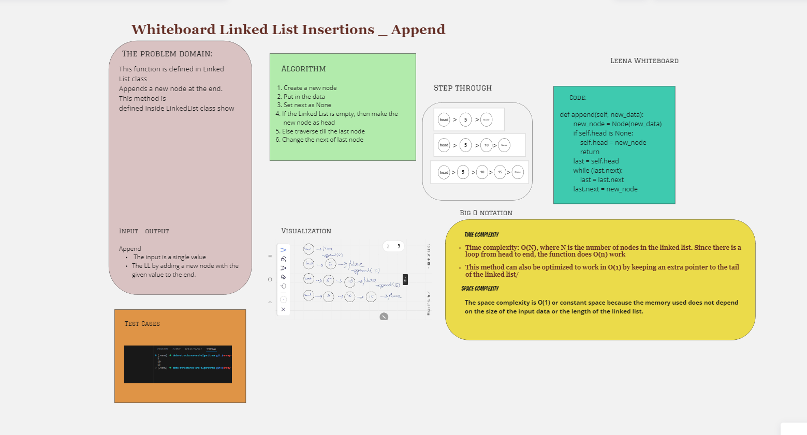
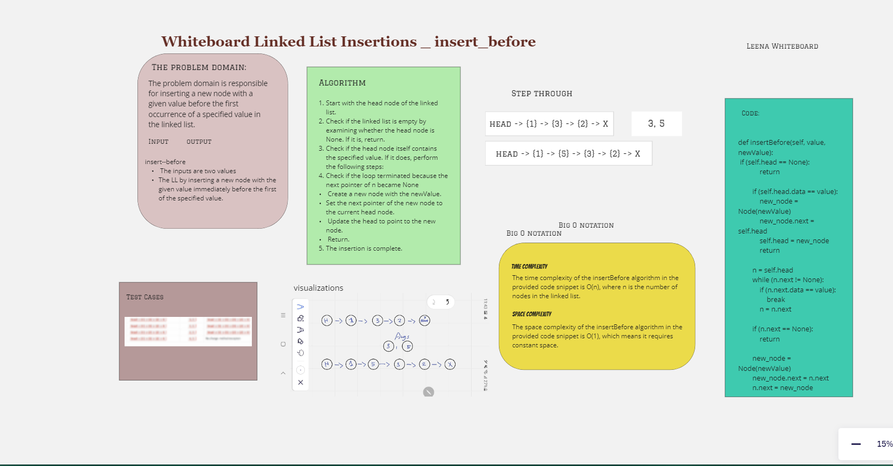

# Challenge_Class_06||  Linked List Insertions

The Linked List (LL) class have three methods which the first for append, the second for insert_before, and last one for insert_after
The append method focuses on extending the linked list by adding a new node to the end.
The Insert_before method deals with inserting a new node before the first occurrence of a specified value in the list.
The  Insert_after method involves inserting a new node after the first occurrence of a specified value in the list

## Whiteboard Process

### Linked List Insertions _ Append



### Linked List Insertions _ Before



### Linked List Insertions _ After


## Approach & Efficiency

### Linked List Insertions _Append

The approach is to create a new node with the new_value and traverse the linked list

### Linked List Insertions_ Before

The approach is to traverse the linked list, find the node with value, and insert the new node before it.

### Linked List Insertions _ After

The approach is to traverse the linked list, find the node with value, and insert the new node after it

## Big O

### Linked List Insertions _ Append

**Time complexity** Since there is a loop from head to end, the function does O(n) work
This method can also be optimized to work in O(1) by keeping an extra pointer to the tail of the linked list.<br>
**Space complexity** The space complexity is O(1) or constant space because the memory used does not depend on the size of the input data or the length of the linked list.

### Linked List Insertions _ Before

**Time complexity** of the insertBefore algorithm in the provided code snippet is O(n), where n is the number of nodes in the linked list.

**The space complexity** of the insertBefore algorithm in the provided code snippet is O(1), which means it requires constant space.

### Linked List Insertions _ After

**The time complexity** of the insert_after method in the given code snippet is O(n), where n is the number of nodes in the linked list.

**The space complexity** of the insert_after method is O(1) because it uses a constant amount of additional space.

## Solution

[Link](./inslinkedlist.py)

### Linked List Insertions _ Append

```python
 class Node:
    def __init__(self, value):
        self.value = value
        self.next = None


class LinkedList:
    def __init__(self):
        self.head = None

    def append(self, new_value):
        new_node = Node(new_value)
        if self.head is None:
            self.head = new_node
        else:
            current = self.head
            while current.next is not None:
                current = current.next
            current.next = new_node
            
    def insertBefore(self, value, newValue):
        if self.head is None:
            return

        if self.head.value == value:
            new_node = Node(newValue)
            new_node.next = self.head
            self.head = new_node
            return

        n = self.head
        while n.next is not None:
            if n.next.value == value:
                break
            n = n.next

        if n.next is None:
            return

        new_node = Node(newValue)
        new_node.next = n.next
        n.next = new_node

    def insert_after(self, value, new_value):
        new_node = Node(new_value)
        temp = self.head
        while temp:
            if temp.value == value:
                new_node.next = temp.next
                temp.next = new_node
                break
            temp = temp.next


       

            ```
